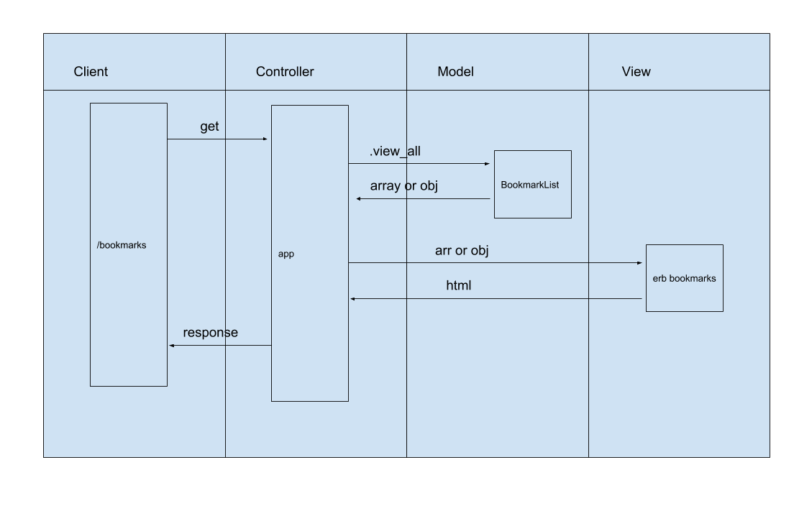

Bookmarks Manager
=================

## Domain model

## Database setup instructions

1. Connect to psql in terminal `psql postgres`
2. Run `CREATE DATABASE bookmark_manager;`
3. Run `psql \c bookmark_manager;` (to connect to new db)
4. Create `bookmarks` table using the query saved in the file `01_create_bookmarks_table.sql`

## Test Database setup instructions

1. Connect to psql in terminal `psql postgres`
2. Run `CREATE DATABASE bookmark_manager_test;`
3. Run `psql \c bookmark_manager_test;` (to connect to new db)
4. Create `bookmarks` table using the query saved in the file `01_create_bookmarks_table.sql`

## Title column added to dev db

1. Connect to postgres in terminal `psql postgres`
2. Run `psql \c bookmark_manager;` (to connect to correct db) 
3. Run `03_add_title_to_bookmarks.sql`

## Title column added to test db

1. Connect to postgres in terminal `psql postgres`
2. Run `psql \c bookmark_manager_test;` (to connect to correct db) 
3. Run `03_add_title_to_bookmarks.sql`